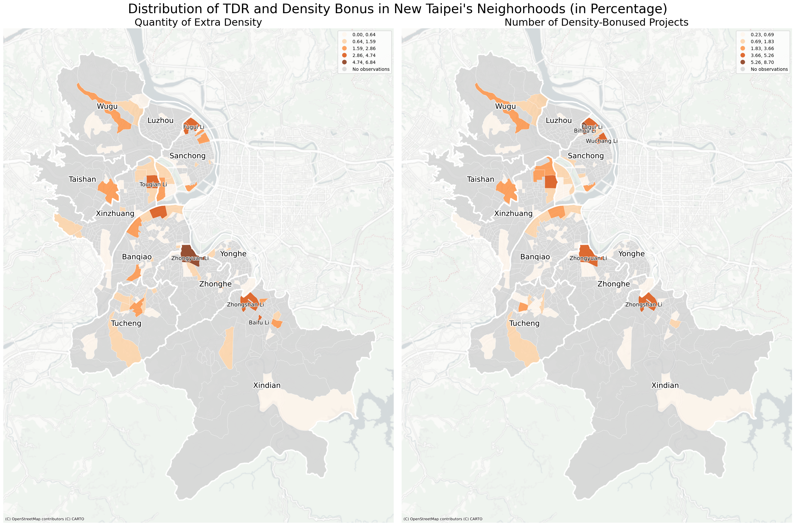

# The Usage of Density-Based Tools in the Land Development of New Taipei City
#### 595 Command-Line GIS Final Project, Spring 2024
#### Yu Wang
## Research Questions
## Introduction
### What are Density-Based Tools?
There has been a widespread popularity of density-based tools that planners around the world use to mobilize land development to extract private profits and public benefits, often with the hope that the former will pay for the latter. In Taiwan planning authorities at all governmental levels grant real estate developers significantly more building density beyond zoning limits, almost rendering FAR (floor area ratio) a development control of little relevance.
*TDR*: A formula measures the grantable extra density based on the amount of reserved land the property developer donates to the city government.
*Density Bonus*: Density bonuses are often granted as an incentive to encourage preferred types of development activity.
### New Taipei City and Data Sources
New Taipei City was originally Taipei County in Taiwan and was promoted to special municipal status and renamed as "New Taipei City" on 25 December 2010. In this process, density-based tools have played a critical role for the government in New Taipei City to boost urban development and capture land value.
This final project relies on dataset provided by the Urban Design Committee of New Taipei City, which contains information about residential construction projects that were granted extra density by different levels of governments in New Taipei City. Housing price data are provided by [Cathy Real Estate](https://www.cathay-red.com.tw/en/About/Info), a real estate company collecting presale housing prices. The data on neighborhood socioeconomic attributes are from [Open Platform of New Taipei City Government](https://data.ntpc.gov.tw/datasets).
### Static Maps
The dataset from the Urban Design Committee is at the project level, listing the quantity of extra density each project received from different types of density bonusing. With the data grouped and aggregated by the neighborhood in which each project is located, the map below illustrates the distribution of extra density gained from TDR and density bonus in New Taipei's neighborhoods.

The serial maps below illustrate the quantity of extra density that construction projects in each neighborhood received from different types of density bonusing. 

### Interactive Maps
<iframe src = "time_stamped.html" height = "800" width = "1080"></iframe> [Open this map as a new page](time_stamped.html).
